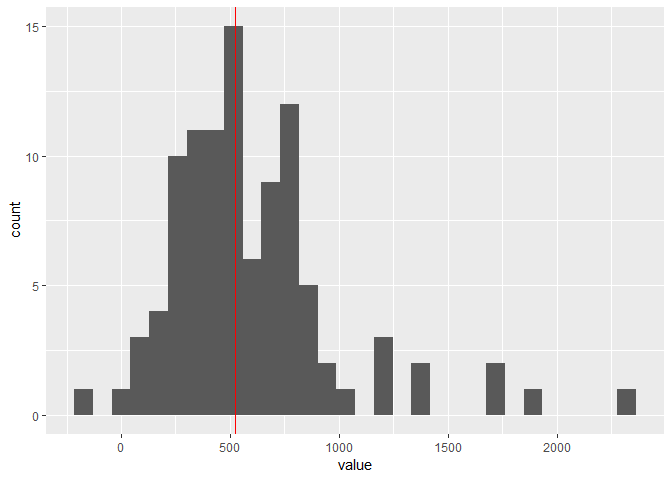

Data Analysis 3: Week 10
================
Alexey Bessudnov
21 March 2019

Plan for today.

-   Assignment 5: discuss
-   Functions in R

Exercises.

Exercise 1. Write a function to calculate the mean of a numeric vector.

``` r
myMean <- function(x) {
  sum(x) / length(x)
}

myMean(1:10)
```

    ## [1] 5.5

``` r
mean(1:10)
```

    ## [1] 5.5

Exercise 2. Modify this function to include an extra argument to deal with missing values.

``` r
myMean2 <- function(x, rm.missing = FALSE) {
        if (rm.missing == TRUE) {
                x <- na.omit(x)
        }
        sum(x) / length(x)
}

myMean(1:10)
```

    ## [1] 5.5

``` r
myMean2(c(1:10, NA))
```

    ## [1] NA

``` r
myMean2(c(1:10, NA), rm.missing = TRUE)
```

    ## [1] 5.5

Exercise 3. Modify this function to return an error when the vector is not numeric.

``` r
myMean3 <- function(x, rm.missing = FALSE) {
        if (!is.numeric(x)) {
                stop("The vector is not numeric.")
        }
        if (rm.missing == TRUE) {
                x <- na.omit(x)
        }
        sum(x) / length(x)
}
# myMean3(c(1:10, "a"))
```

Exercise 4. Modify this function so that it saves the mean in the environment with the name "meanx". (Hint: think about environments.)

``` r
myMean(1:10)
```

    ## [1] 5.5

``` r
# meanx <- myMean(1:10)
myMean4 <- function(x) {
        meanx <<- sum(x) / length(x)
        meanx
}
myMean4(1:10)
```

    ## [1] 5.5

Exercise 5. Write a function to calculate the factorial (i.e. 5! = 1x2x3x4x5). Note that 0! = 1, and for the negative numbers the factorial is not defined. (Hint: use recursion.)

``` r
myFactorial <- function(x){
  if (x == 0) {return(1)}
  x * myFactorial(x-1)
}

myFactorial(4)
```

    ## [1] 24

Exercise 6. Use this function to calculate the factorial for the numbers from 1 to 10. (Hint: use map()).

``` r
# this is not going to work because the function has not been vectorised
myFactorial(1:10)
```

    ## Warning in if (x == 0) {: the condition has length > 1 and only the first
    ## element will be used

    ## Warning in if (x == 0) {: the condition has length > 1 and only the first
    ## element will be used

    ##  [1]  1  2  3  4  5  6  7  8  9 10

``` r
# a for() loop
output <- numeric(10)
for (i in 1:10) {
  output[i] <- myFactorial(i)
}
output
```

    ##  [1]       1       2       6      24     120     720    5040   40320
    ##  [9]  362880 3628800

``` r
# with map()

library(tidyverse)
```

    ## Warning: package 'tidyverse' was built under R version 3.5.3

    ## -- Attaching packages --------------------------------------------------------- tidyverse 1.2.1 --

    ## v ggplot2 3.1.0       v purrr   0.3.2  
    ## v tibble  2.1.1       v dplyr   0.8.0.1
    ## v tidyr   0.8.3       v stringr 1.4.0  
    ## v readr   1.3.1       v forcats 0.4.0

    ## Warning: package 'tibble' was built under R version 3.5.3

    ## Warning: package 'tidyr' was built under R version 3.5.3

    ## Warning: package 'purrr' was built under R version 3.5.3

    ## Warning: package 'dplyr' was built under R version 3.5.3

    ## Warning: package 'stringr' was built under R version 3.5.3

    ## Warning: package 'forcats' was built under R version 3.5.3

    ## -- Conflicts ------------------------------------------------------------ tidyverse_conflicts() --
    ## x dplyr::filter() masks stats::filter()
    ## x dplyr::lag()    masks stats::lag()

``` r
mapply(myFactorial, 1:10)
```

    ##  [1]       1       2       6      24     120     720    5040   40320
    ##  [9]  362880 3628800

``` r
map_dbl(1:10, myFactorial)
```

    ##  [1]       1       2       6      24     120     720    5040   40320
    ##  [9]  362880 3628800

Exercise 7. Open the indresp file for wave 8 and keep two variables: sex (h\_sex\_dv) and total net personal income (h\_fimnnet\_dv). You may need to clean sex and retain only values for male and female. Keep only cases with non-missing values for sex and income.

1.  regress income on sex (i.e. find the difference between mean income for men and women). Store the estimate for the regression coefficient.
2.  Now regress income on sex 100 times, each time with a random sample of 1,000 people. Store 100 regression coefficients in a vector and illustrate their distribution graphically.
3.  Now do the same, changing the sample size to 100 people, and compare two distributions.

``` r
df <- read_tsv("data/UKDA-6614-tab/tab/ukhls_w8/h_indresp.tab") %>%
        select(h_sex_dv, h_fimnnet_dv)
```

    ## Parsed with column specification:
    ## cols(
    ##   .default = col_double()
    ## )

    ## See spec(...) for full column specifications.

``` r
df <- df %>%
        mutate(h_sex_dv = ifelse(h_sex_dv == 1, "male",
                      ifelse(h_sex_dv == 2, "female", NA))) %>%
        filter(!is.na(h_sex_dv)) %>%
        filter(!is.na(h_fimnnet_dv))

est <- lm(h_fimnnet_dv ~ h_sex_dv, df)$coefficients[[2]]

output <- numeric(100)
for (i in 1:100) {
  df1 <- df %>% sample_n(1000)
  output[i] <- lm(h_fimnnet_dv ~ h_sex_dv, df1)$coefficients[[2]]
}
output
```

    ##   [1] 549.1761 638.9182 480.5021 574.7991 386.3547 682.2085 268.0886
    ##   [8] 493.8055 288.6952 786.6175 481.1754 963.0731 696.0625 597.9668
    ##  [15] 511.3167 250.6693 582.9242 533.8147 597.0916 579.5763 515.6116
    ##  [22] 381.3941 568.3213 552.4568 160.1180 667.9447 436.9176 535.1815
    ##  [29] 450.8286 432.8508 577.8669 526.0012 501.1579 664.9957 383.6582
    ##  [36] 623.7132 640.2755 493.0639 404.6236 620.3179 776.5415 670.0984
    ##  [43] 543.6572 488.4453 438.1857 491.4051 601.2727 431.9875 554.4684
    ##  [50] 772.2927 565.1970 629.7371 436.3695 421.9332 444.5136 450.4886
    ##  [57] 438.4466 583.6113 342.8162 405.2785 397.6666 720.1695 594.1165
    ##  [64] 373.1713 541.7782 497.8629 579.8523 497.6426 378.4445 534.0943
    ##  [71] 668.9688 469.7555 543.6384 423.8027 764.6818 567.2260 354.3069
    ##  [78] 607.0610 407.0551 624.0524 632.4803 316.3834 538.3572 514.9377
    ##  [85] 396.2110 464.5421 716.8433 608.4783 474.3328 462.8116 892.9964
    ##  [92] 615.3840 531.6423 577.9113 655.1918 637.3091 447.0126 610.8422
    ##  [99] 413.9765 391.0547

``` r
sexCoef <- map(1:100, ~ df %>% sample_n(100)) %>%
        map_dbl(~ lm(h_fimnnet_dv ~ h_sex_dv, data = .)$coefficients[2])

enframe(sexCoef) %>%
        ggplot(aes(x = value)) +
        geom_histogram() +
        geom_vline(xintercept = est, colour = "red")
```

    ## `stat_bin()` using `bins = 30`. Pick better value with `binwidth`.


