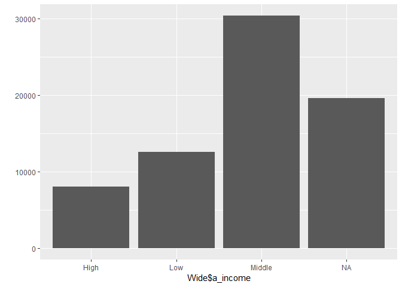
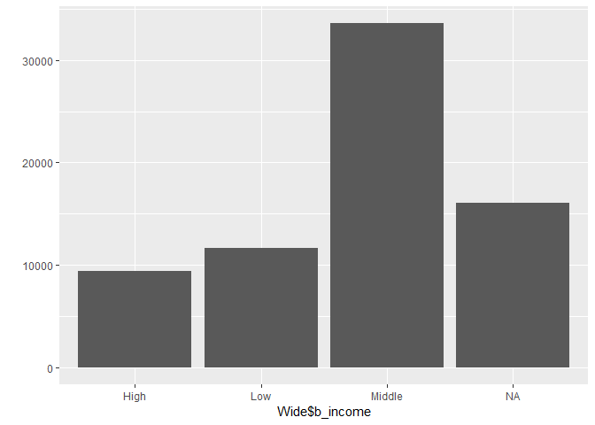
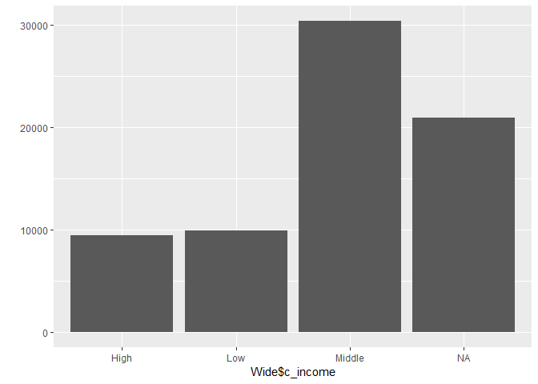
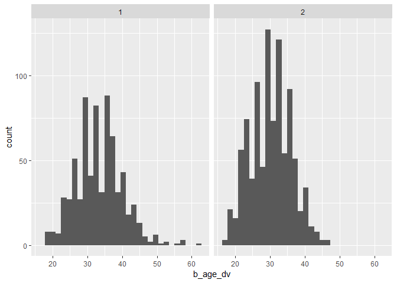
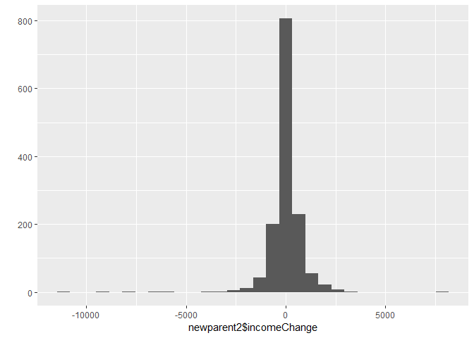

Data Analysis 3: Week 11
================
Alexey Bessudnov
28 March 2019

Plan for today.

1.  Assignment 5: solutions.
2.  Final reports.

**Longitudinal data.**

Example from class 5.

``` r
library(tidyverse)
# Read data and select variables
Ind1 <- read_tsv("data/UKDA-6614-tab/tab/ukhls_w1/a_indresp.tab")
Ind1 <- Ind1 %>%
  select(pidp, a_sex_dv, a_age_dv, a_fimnnet_dv)
Ind2 <- read_tsv("data/UKDA-6614-tab/tab/ukhls_w2/b_indresp.tab")
Ind2 <- Ind2 %>%
  select(pidp, b_sex_dv, b_age_dv, b_fimnnet_dv)
Ind3 <- read_tsv("data/UKDA-6614-tab/tab/ukhls_w3/c_indresp.tab")
Ind3 <- Ind3 %>%
  select(pidp, c_sex_dv, c_age_dv, c_fimnnet_dv)

Wide <- Ind1 %>%
  full_join(Ind2, by = "pidp") %>%
  full_join(Ind3, by = "pidp")
Wide
```

    ## # A tibble: 70,585 x 10
    ##      pidp a_sex_dv a_age_dv a_fimnnet_dv b_sex_dv b_age_dv b_fimnnet_dv
    ##     <dbl>    <dbl>    <dbl>        <dbl>    <dbl>    <dbl>        <dbl>
    ##  1 6.80e7        1       39        1400        NA       NA         NA  
    ##  2 6.80e7        1       59         802.        1       60       1277. 
    ##  3 6.80e7        2       39        1180.        2       40       1116. 
    ##  4 6.80e7        2       17         130        NA       NA         NA  
    ##  5 6.80e7        2       72         673         2       73        966. 
    ##  6 6.80e7        2       57         400         2       58         16.7
    ##  7 6.80e7        1       59         708        NA       NA         NA  
    ##  8 6.80e7        1       25         857        NA       NA         NA  
    ##  9 6.80e7        1       22        1525.       NA       NA         NA  
    ## 10 6.80e7        2       38         552.        2       39        542. 
    ## # ... with 70,575 more rows, and 3 more variables: c_sex_dv <dbl>,
    ## #   c_age_dv <dbl>, c_fimnnet_dv <dbl>

``` r
# convert to long

Long <- Wide %>%
  gather(a_sex_dv:c_fimnnet_dv, key = "variable", value = "value") %>%
  separate(variable, into = c("wave", "variable"), sep = "_", extra = "merge") %>%
  spread(key = variable, value = value)
Long
```

    ## # A tibble: 211,755 x 5
    ##      pidp wave  age_dv fimnnet_dv sex_dv
    ##     <dbl> <chr>  <dbl>      <dbl>  <dbl>
    ##  1 280165 a         NA        NA      NA
    ##  2 280165 b         31      1728.      2
    ##  3 280165 c         32      2303.      2
    ##  4 541285 a         NA        NA      NA
    ##  5 541285 b         NA        NA      NA
    ##  6 541285 c         25       780.      1
    ##  7 541965 a         NA        NA      NA
    ##  8 541965 b         NA        NA      NA
    ##  9 541965 c         23      1156.      2
    ## 10 665045 a         NA        NA      NA
    ## # ... with 211,745 more rows

Let's make income categorical to make it closer to your question 1.

``` r
summary(Long$fimnnet_dv)
```

    ##    Min. 1st Qu.  Median    Mean 3rd Qu.    Max.    NA's 
    ##  -15000     572    1080    1290    1685  350392   56508

``` r
Long <- Long %>%
        mutate(income = case_when(
               fimnnet_dv < 500 ~ "Low",
               fimnnet_dv >= 500 & fimnnet_dv < 2000 ~ "Middle",
               fimnnet_dv >= 2000 ~ "High"
        )) %>%
        mutate(sex_dv = ifelse(sex_dv == 2, "female", ifelse(sex_dv == 1, "male", NA)))
Long               
```

    ## # A tibble: 211,755 x 6
    ##      pidp wave  age_dv fimnnet_dv sex_dv income
    ##     <dbl> <chr>  <dbl>      <dbl> <chr>  <chr> 
    ##  1 280165 a         NA        NA  <NA>   <NA>  
    ##  2 280165 b         31      1728. female Middle
    ##  3 280165 c         32      2303. female High  
    ##  4 541285 a         NA        NA  <NA>   <NA>  
    ##  5 541285 b         NA        NA  <NA>   <NA>  
    ##  6 541285 c         25       780. male   Middle
    ##  7 541965 a         NA        NA  <NA>   <NA>  
    ##  8 541965 b         NA        NA  <NA>   <NA>  
    ##  9 541965 c         23      1156. female Middle
    ## 10 665045 a         NA        NA  <NA>   <NA>  
    ## # ... with 211,745 more rows

``` r
# and back to wide

Wide <- Long %>%
  gather(age_dv:income, key = "variable", value = "value") %>%
  unite("variable", c("wave", "variable"), sep = "_") %>%
  spread(key = variable, value = value)

Wide %>%
        select(pidp, a_income, b_income, c_income)
```

    ## # A tibble: 70,585 x 4
    ##       pidp a_income b_income c_income
    ##      <dbl> <chr>    <chr>    <chr>   
    ##  1  280165 <NA>     Middle   High    
    ##  2  541285 <NA>     <NA>     Middle  
    ##  3  541965 <NA>     <NA>     Middle  
    ##  4  665045 <NA>     <NA>     Middle  
    ##  5  956765 <NA>     High     Middle  
    ##  6  987365 <NA>     Middle   Low     
    ##  7 1114525 <NA>     High     <NA>    
    ##  8 1126765 <NA>     Low      <NA>    
    ##  9 1558565 <NA>     Low      Middle  
    ## 10 1833965 <NA>     Middle   Middle  
    ## # ... with 70,575 more rows

You may want to first look at the distributions.

``` r
qplot(Wide$a_income)
```



``` r
qplot(Wide$b_income)
```



``` r
qplot(Wide$c_income)
```



Trajectorties.

``` r
Wide <- Wide %>%
        unite("type", a_income, b_income, c_income)
Wide %>% count(type) %>% arrange(-n) %>% print(n = 50)
```

    ## # A tibble: 63 x 2
    ##    type                     n
    ##    <chr>                <int>
    ##  1 Middle_Middle_Middle 13947
    ##  2 NA_Middle_Middle      6629
    ##  3 Middle_NA_NA          6062
    ##  4 High_High_High        3492
    ##  5 Middle_Middle_NA      3452
    ##  6 Low_NA_NA             3058
    ##  7 Low_Low_Low           2932
    ##  8 NA_Low_Low            2118
    ##  9 Low_Middle_Middle     1891
    ## 10 NA_Middle_NA          1798
    ## 11 NA_High_High          1635
    ## 12 NA_NA_Low             1540
    ## 13 NA_NA_Middle          1414
    ## 14 High_NA_NA            1387
    ## 15 Low_Low_Middle        1232
    ## 16 Low_Low_NA            1210
    ## 17 Middle_Middle_High    1166
    ## 18 NA_Low_NA             1012
    ## 19 Middle_NA_Middle       929
    ## 20 NA_Low_Middle          903
    ## 21 Middle_Middle_Low      858
    ## 22 Middle_Low_Middle      844
    ## 23 Middle_High_High       838
    ## 24 High_High_NA           727
    ## 25 Low_Middle_NA          716
    ## 26 High_Middle_Middle     646
    ## 27 NA_Middle_Low          599
    ## 28 Middle_High_Middle     597
    ## 29 Middle_Low_Low         583
    ## 30 NA_Middle_High         572
    ## 31 Low_Middle_Low         545
    ## 32 High_High_Middle       448
    ## 33 NA_NA_High             433
    ## 34 NA_High_Middle         422
    ## 35 Middle_Low_NA          406
    ## 36 NA_High_NA             402
    ## 37 High_Middle_High       395
    ## 38 Middle_High_NA         377
    ## 39 Low_NA_Low             293
    ## 40 High_NA_High           261
    ## 41 Low_NA_Middle          256
    ## 42 High_Middle_NA         204
    ## 43 Middle_NA_High         141
    ## 44 Middle_NA_Low          125
    ## 45 Low_Middle_High        122
    ## 46 Low_High_High          108
    ## 47 High_NA_Middle          84
    ## 48 High_High_Low           83
    ## 49 High_Low_High           70
    ## 50 High_Low_Middle         66
    ## # ... with 13 more rows

If you want to do something more advanced use sequence analysis and the package TraMiNer: <http://traminer.unige.ch/> .

**Childbirth and satisfaction**

The key thing here is to identify new childbirths. Note the *newborn* data sets: <https://www.understandingsociety.ac.uk/documentation/mainstage/dataset-documentation> . You want to create a data frame that includes only new mothers and fathers.

``` r
newborn2 <- read_tsv("data/UKDA-6614-tab/tab/ukhls_w2/b_newborn.tab")
```

At this stage you may want to filter out those who don't live with their children or whose children died.

``` r
# identify new parents in wave 2

newparent2 <- Ind2 %>%
        semi_join(newborn2, by = "pidp")

newparent2 %>%
ggplot(aes(x = b_age_dv)) +
        geom_histogram() +
        facet_wrap(~ b_sex_dv)
```



We can also look at how income changes in the wave following the childbirth.

``` r
newparent2 <- newparent2 %>%
        left_join(Ind3, by = "pidp") %>%
        mutate(incomeChange = c_fimnnet_dv - b_fimnnet_dv)
qplot(newparent2$incomeChange)
```



``` r
newparent2 %>%
        group_by(b_sex_dv) %>%
        summarise(
                meanChange = mean(incomeChange, na.rm = TRUE)
        )
```

    ## # A tibble: 2 x 2
    ##   b_sex_dv meanChange
    ##      <dbl>      <dbl>
    ## 1        1       19.3
    ## 2        2       17.3

Things will become more complex when you've got the data from all waves.

If you want to something more complicated: 1) Explore change in satisfaction after the childbirth within the household. 2) Try to fit fixed-effects models: see <https://cran.r-project.org/web/packages/plm/vignettes/plmPackage.html>

**Combination of individual- and household-level data: household composition by ethnic group.**

``` r
Egoalt1 <- read_tsv("data/UKDA-6614-tab/tab/ukhls_w1/a_egoalt.tab")
```

Let us look at the household with a\_hidp 68006123.

``` r
oneHH <- Egoalt1 %>%
        filter(a_hidp == 68006123) %>%
        select(a_hidp, pidp, apidp, a_relationship_dv, a_esex, a_asex)
oneHH
```

    ## # A tibble: 12 x 6
    ##      a_hidp     pidp    apidp a_relationship_dv a_esex a_asex
    ##       <dbl>    <dbl>    <dbl>             <dbl>  <dbl>  <dbl>
    ##  1 68006123 68006127 68006131                 2      2      1
    ##  2 68006123 68006127 68006135                 9      2      2
    ##  3 68006123 68006127 68006139                 9      2      2
    ##  4 68006123 68006131 68006127                 2      1      2
    ##  5 68006123 68006131 68006135                12      1      2
    ##  6 68006123 68006131 68006139                12      1      2
    ##  7 68006123 68006135 68006127                 4      2      2
    ##  8 68006123 68006135 68006131                 7      2      1
    ##  9 68006123 68006135 68006139                14      2      2
    ## 10 68006123 68006139 68006127                 4      2      2
    ## 11 68006123 68006139 68006131                 7      2      1
    ## 12 68006123 68006139 68006135                14      2      2

THis is a household with four people: a couple with two children (so the relationships are 2 (partner/cohabitee), 9 (parent), 12 (step-parent), 4 (natural son/daughter), 7 (stepson/stepdaughter), 14 (natural brother/sister). More specifically, it's a woman with two daughters and their step-father, the woman's partner (they are not married).

The key thing here is to write a code that identifies a household type from this information. Then you can look at the distribution of the types by ethnic group. Note that ethnic group is an individual, not household characteristics, so you will need to develop some rules on how you deal with ethnically mixed households.

As an example, let us calculate the number of people in the household by ethnic group.

``` r
Ind1new <- read_tsv("data/UKDA-6614-tab/tab/ukhls_w1/a_indresp.tab")
Ind1new <- Ind1new %>%
  select(pidp, a_hidp, a_sex_dv, a_age_dv, a_racel_dv)

Ind1new %>%
        group_by(a_hidp) %>%
        mutate(nhh = n()) %>%
        group_by(a_racel_dv) %>%
        summarise(hhsize = mean(nhh, na.rm = TRUE))
```

    ## # A tibble: 19 x 2
    ##    a_racel_dv hhsize
    ##         <dbl>  <dbl>
    ##  1         -9   2.72
    ##  2          1   1.99
    ##  3          2   1.89
    ##  4          3   1.56
    ##  5          4   1.97
    ##  6          5   1.96
    ##  7          6   2.08
    ##  8          7   2.18
    ##  9          8   2.16
    ## 10          9   2.55
    ## 11         10   2.73
    ## 12         11   2.87
    ## 13         12   2.06
    ## 14         13   2.20
    ## 15         14   1.77
    ## 16         15   2.04
    ## 17         16   1.99
    ## 18         17   2.19
    ## 19         97   2.01

This is actually not quite correct (since ethnicity is an individual-level variable) and you will be able to do better than this.

Let us get some more details on household 68006123.

``` r
oneHH %>%
        left_join(Ind1new, by = c("a_hidp", "pidp"))
```

    ## # A tibble: 12 x 9
    ##    a_hidp   pidp  apidp a_relationship_~ a_esex a_asex a_sex_dv a_age_dv
    ##     <dbl>  <dbl>  <dbl>            <dbl>  <dbl>  <dbl>    <dbl>    <dbl>
    ##  1 6.80e7 6.80e7 6.80e7                2      2      1        2       39
    ##  2 6.80e7 6.80e7 6.80e7                9      2      2        2       39
    ##  3 6.80e7 6.80e7 6.80e7                9      2      2        2       39
    ##  4 6.80e7 6.80e7 6.80e7                2      1      2       NA       NA
    ##  5 6.80e7 6.80e7 6.80e7               12      1      2       NA       NA
    ##  6 6.80e7 6.80e7 6.80e7               12      1      2       NA       NA
    ##  7 6.80e7 6.80e7 6.80e7                4      2      2        2       17
    ##  8 6.80e7 6.80e7 6.80e7                7      2      1        2       17
    ##  9 6.80e7 6.80e7 6.80e7               14      2      2        2       17
    ## 10 6.80e7 6.80e7 6.80e7                4      2      2       NA       NA
    ## 11 6.80e7 6.80e7 6.80e7                7      2      1       NA       NA
    ## 12 6.80e7 6.80e7 6.80e7               14      2      2       NA       NA
    ## # ... with 1 more variable: a_racel_dv <dbl>

So the woman is 39 years old and of her daughters is 17. They are both White British. The male partner and the other daughter were not interviewed. We might get some more informatiom about them from the *indall* file.

``` r
Indall1 <- read_tsv("data/UKDA-6614-tab/tab/ukhls_w1/a_indall.tab") %>%
        filter(a_hidp == 68006123) %>%
        select(a_hidp, pidp, a_sex_dv, a_age_dv, a_ethn_dv)
Indall1
```

    ## # A tibble: 4 x 5
    ##     a_hidp     pidp a_sex_dv a_age_dv a_ethn_dv
    ##      <dbl>    <dbl>    <dbl>    <dbl>     <dbl>
    ## 1 68006123 68006127        2       39         1
    ## 2 68006123 68006131        1       34         1
    ## 3 68006123 68006135        2       17         1
    ## 4 68006123 68006139        2       14         1

The male partner is 34 and the other daughter is 14. They are also White British.

Since the other daughter is only 14 maybe we'll be able to locate her in the children's file?

``` r
Youth1 <- read_tsv("data/UKDA-6614-tab/tab/ukhls_w1/a_youth.tab") %>%
        filter(pidp == 68006123) %>%
        select(pidp, a_sex_dv, a_age_dv, a_ethn_dv)
Youth1
```

    ## # A tibble: 0 x 4
    ## # ... with 4 variables: pidp <dbl>, a_sex_dv <dbl>, a_age_dv <dbl>,
    ## #   a_ethn_dv <dbl>

You want to use the **indall** rather than **indresp** files for this question.
