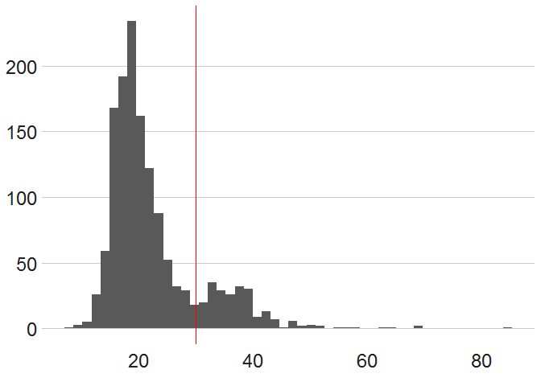
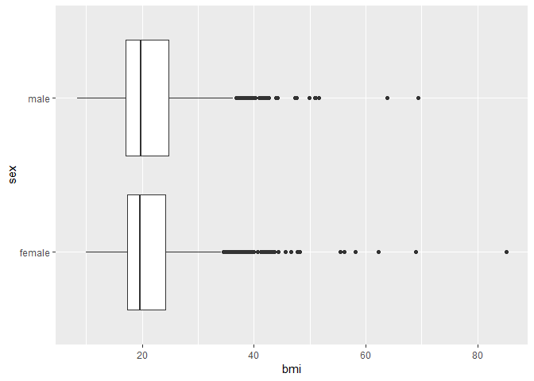
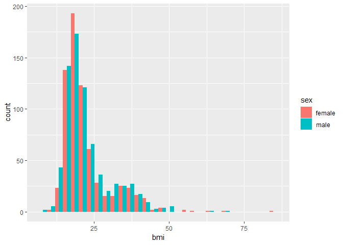
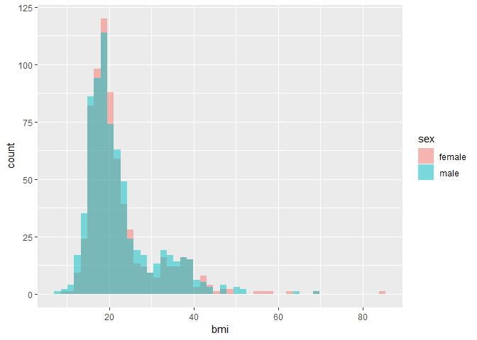
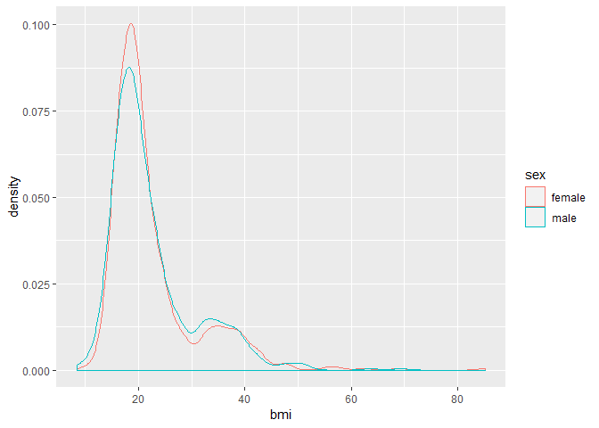
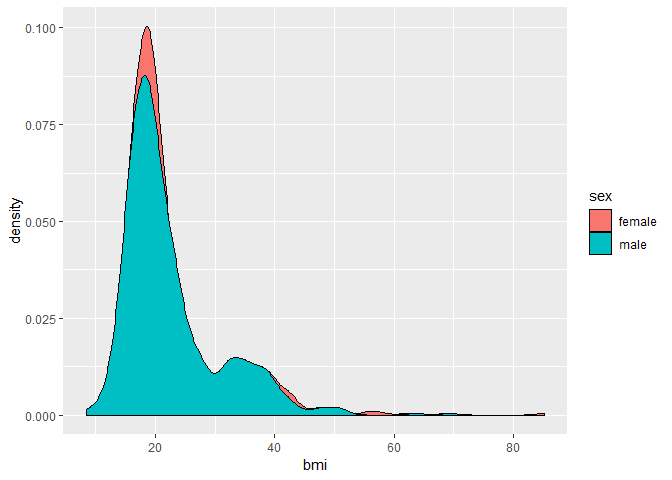
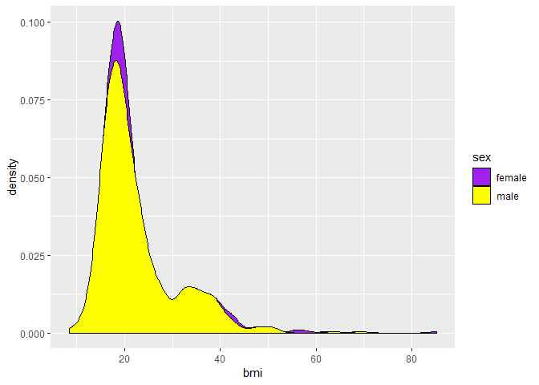
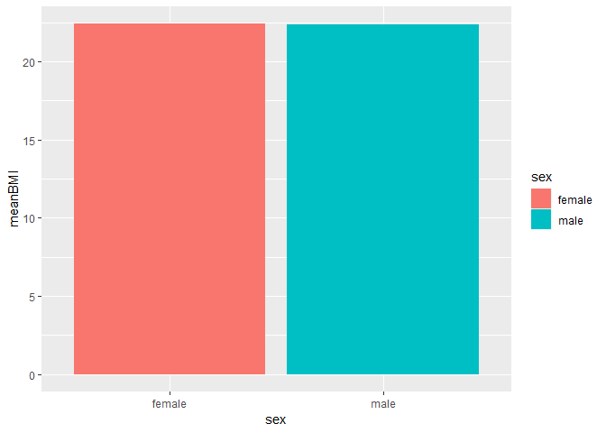
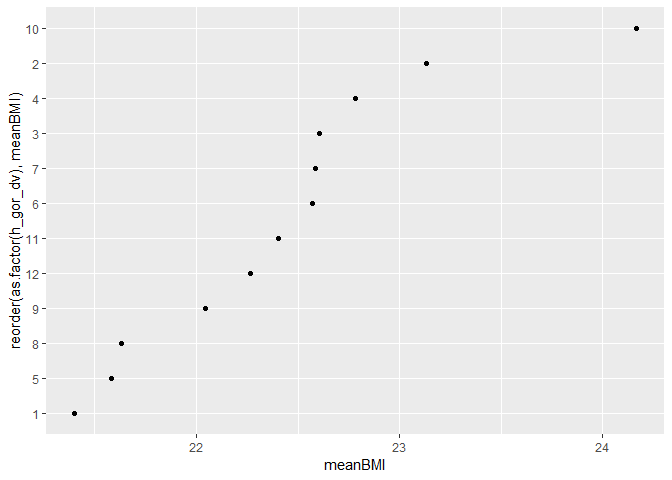
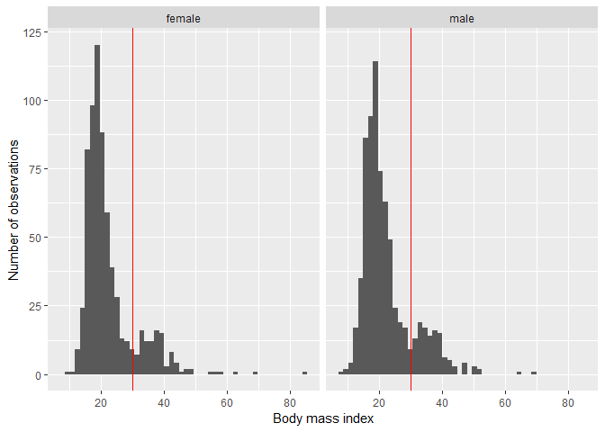

Data Analysis 3: Week 7
================
Alexey Bessudnov
1 March 2019

Plan for today:

1.  Machine learning workshop at the RSS.
2.  Exercises on data visualisation.
3.  Homework for next week: data structures.

Exercises:

1.  Open the data from the youth questionnaire from wave 8.
2.  Today we will be working with the variable on BMI (h\_ypbmi\_dv) and visualise the distribution of BMI by sex, age, and ethnic group.

``` r
library(tidyverse)
youth8 <- read_tsv("data/UKDA-6614-tab/tab/ukhls_w8/h_youth.tab")

# summary(youth8$h_ypbmi_dv)
youth8 %>% pull(h_ypbmi_dv) %>% summary()
```

    ##    Min. 1st Qu.  Median    Mean 3rd Qu.    Max. 
    ##  -9.000  -9.000  -9.000   4.576  19.000  85.200

``` r
youth8 <- youth8 %>%
  mutate(bmi = recode(h_ypbmi_dv, `-9` = NA_real_))

youth8 %>% pull(bmi) %>% summary()
```

    ##    Min. 1st Qu.  Median    Mean 3rd Qu.    Max.    NA's 
    ##    8.40   17.20   19.70   22.40   24.27   85.20    1856

``` r
# simple histogram

youth8 %>%
  ggplot(aes(x = bmi)) +
  geom_histogram(bins = 50) +
  geom_vline(xintercept = 30, colour = "red") +
  xlab("Body mass index") +
  ylab("Number of observations")
```


``` r
# BBC style

library(bbplot)
youth8 %>%
  ggplot(aes(x = bmi)) +
  geom_histogram(bins = 50) +
  geom_vline(xintercept = 30, colour = "red") +
  ylab("Number of observations") +
  bbc_style() +
  xlab("Body mass index")
```



BMI by sex.

Boxplot:

``` r
youth8 <- youth8 %>%
  mutate(sex = ifelse(h_sex_dv == 2, "female",
                      ifelse(h_sex_dv == 1, "male", NA)))
youth8 %>% count(h_sex_dv, sex)
```

    ## # A tibble: 2 x 3
    ##   h_sex_dv sex        n
    ##      <dbl> <chr>  <int>
    ## 1        1 male    1619
    ## 2        2 female  1651

``` r
youth8 %>%
  ggplot(aes(x = sex, y = bmi)) +
  geom_boxplot() +
  # this changes the boxplots from vertical to horizontal
  coord_flip()
```



density by group

``` r
youth8 %>%
  ggplot(aes(x = bmi, fill = sex)) +
  geom_histogram(position = "dodge")
```



``` r
youth8 %>%
  ggplot(aes(x = bmi, fill = sex)) +
  geom_histogram(bins = 50, position = "identity", alpha = 0.5)
```



``` r
youth8 %>%
  ggplot(aes(x = bmi, colour = sex)) +
  geom_density()
```



``` r
youth8 %>%
  ggplot(aes(x = bmi, fill = sex)) +
  geom_density()
```



``` r
youth8 %>%
  ggplot(aes(x = bmi, fill = sex)) +
  geom_density() +
  # manually setting the colours
  scale_fill_manual(values = c("purple", "yellow"))
```



Barplot with means.

``` r
youth8 %>%
  group_by(sex) %>%
  summarise(
    meanBMI = mean(bmi, na.rm = TRUE)
  ) %>%
  ggplot(aes(x = sex, y = meanBMI, fill = sex)) +
  geom_bar(stat = "identity")
```



``` r
youth8 %>%
  group_by(sex) %>%
  summarise(
    meanBMI = mean(bmi, na.rm = TRUE)
  ) %>%
  ggplot(aes(x = sex, y = meanBMI)) +
  geom_point() +
  ylim(0, 25) +
  coord_flip()
```


``` r
youth8 %>%
  group_by(h_gor_dv) %>%
  summarise(
    meanBMI = mean(bmi, na.rm = TRUE)
  ) %>%
  ggplot(aes(x = reorder(as.factor(h_gor_dv), meanBMI), y = meanBMI)) +
  geom_point() +
  coord_flip()
```



Faceted chart.

``` r
youth8 %>%
  ggplot(aes(x = bmi)) +
  geom_histogram(bins = 50) +
  geom_vline(xintercept = 30, colour = "red") +
  xlab("Body mass index") +
  ylab("Number of observations") +
  facet_wrap(~ sex)
```


