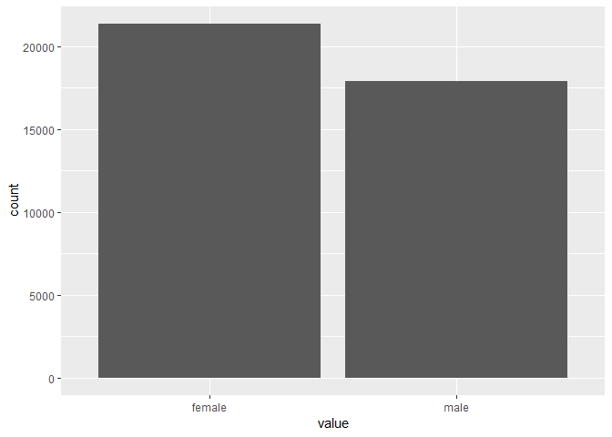

Data Analysis 3: Week 8
================
Alexey Bessudnov
7 March 2019

Plan for today:

1.  Assignment 3: solution.
2.  Assignment 4.
3.  Final statistical report.
4.  Exercises: factors and other data types.
5.  Homework for next week: control structures (if ... else) and iteration.

-   Types of variables in social science research.

-   R data structures.

-   Vectors.

Numeric (integer and double). Vectorisation.

``` r
x <- 1:6
typeof(x)
```

    ## [1] "integer"

``` r
length(x)
```

    ## [1] 6

``` r
y <- c(1.2, 1.5, 2.76)
typeof(y)
```

    ## [1] "double"

``` r
length(y)
```

    ## [1] 3

``` r
x*2
```

    ## [1]  2  4  6  8 10 12

``` r
x + y
```

    ## [1] 2.20 3.50 5.76 5.20 6.50 8.76

Exercise 1. Create a vector of length 100, randomly drawing it from the standard normal distribution. Find the mean and standard deviation. Multiply the vector by 2. Are the mean and standard deviation going to change?

``` r
x <- rnorm(100)
head(x)
```

    ## [1] -0.7393141  0.2477398 -1.0358360 -0.2133745  0.1016079 -1.6731608

``` r
mean(x)
```

    ## [1] -0.06945599

``` r
mean(x*2)
```

    ## [1] -0.138912

``` r
sd(x)
```

    ## [1] 0.8964047

``` r
sd(x*2)
```

    ## [1] 1.792809

Exercise 2. Read the individual wave 8 UndSoc data and extract the variable for age from the data frame. What type is it?

``` r
library(tidyverse)
df <- read_tsv("data/UKDA-6614-tab/tab/ukhls_w8/h_indresp.tab")
df %>% pull(h_age_dv) %>% typeof()
```

    ## [1] "double"

``` r
df %>% pull(h_age_dv) %>% table()
```

    ## .
    ##  16  17  18  19  20  21  22  23  24  25  26  27  28  29  30  31  32  33 
    ## 554 625 583 567 537 541 555 562 547 495 462 474 461 484 500 500 550 543 
    ##  34  35  36  37  38  39  40  41  42  43  44  45  46  47  48  49  50  51 
    ## 556 592 685 655 622 645 605 618 673 676 675 701 771 751 754 758 728 745 
    ##  52  53  54  55  56  57  58  59  60  61  62  63  64  65  66  67  68  69 
    ## 706 675 708 703 686 675 647 656 591 616 569 634 538 605 516 571 604 642 
    ##  70  71  72  73  74  75  76  77  78  79  80  81  82  83  84  85  86  87 
    ## 622 517 487 434 426 403 361 350 316 314 275 255 213 195 177 176 136 121 
    ##  88  89  90  91  92  93  94  95  96  97  98  99 100 101 102 
    ## 117  72  63  43  27  30  21  16  10   5   5   2   3   3   2

``` r
age <- df %>% pull(h_age_dv)
typeof(age)
```

    ## [1] "double"

``` r
age <- as.integer(age)
typeof(age)
```

    ## [1] "integer"

Logical vectors.

Exercise 3. Convert sex into a logical vector for being male. Calculate the proportion of men in the data set.

``` r
sex <- df %>% pull(h_sex_dv)
male <- ifelse(sex == 1, TRUE, FALSE)
head(male)
```

    ## [1] FALSE FALSE FALSE  TRUE FALSE FALSE

``` r
typeof(male)
```

    ## [1] "logical"

``` r
TRUE == 1
```

    ## [1] TRUE

``` r
FALSE == 0
```

    ## [1] TRUE

``` r
mean(male)
```

    ## [1] 0.4560055

Character vectors.

Exercise 4. Convert sex into a character vector with the values "male" and "female".

``` r
sex_chr <- ifelse(sex == 1, "male",
                  ifelse(sex == 2, "female", NA))
typeof(sex_chr)
```

    ## [1] "character"

``` r
x <- 1:6
x
```

    ## [1] 1 2 3 4 5 6

``` r
x <- as.character(x)
x
```

    ## [1] "1" "2" "3" "4" "5" "6"

``` r
mean(x)
```

    ## [1] NA

``` r
x <- as.numeric(x)
x
```

    ## [1] 1 2 3 4 5 6

``` r
y <- c("1", "a", "2")
as.numeric(y)
```

    ## [1]  1 NA  2

Factors (augmented numeric).

Exercise 5. Convert sex into a factor. Change the order of levels.

``` r
library(tidyverse)
library(forcats)

sex_fct <- factor(sex_chr)
typeof(sex_fct)
```

    ## [1] "integer"

``` r
class(sex_fct)
```

    ## [1] "factor"

``` r
str(sex_fct)
```

    ##  Factor w/ 2 levels "female","male": 1 1 1 2 1 1 2 2 1 2 ...

``` r
levels(sex_fct)
```

    ## [1] "female" "male"

``` r
sex_fct2 <- factor(sex_chr, levels = c("male", "female"))
levels(sex_fct2)
```

    ## [1] "male"   "female"

``` r
sex_fct3 <- fct_relevel(sex_chr, "male")
levels(sex_fct3)
```

    ## [1] "male"   "female"

``` r
sex_fct3 %>%
  as_tibble() %>%
  filter(!is.na(sex_fct3)) %>%
  ggplot(aes(x = value)) +
  geom_bar()
```


``` r
sex_fct %>%
  as_tibble() %>%
  filter(!is.na(sex_fct3)) %>%
  ggplot(aes(x = value)) +
  geom_bar()
```



Matrices and data frames.

``` r
x <- matrix(1:10, nrow = 2)
x
```

    ##      [,1] [,2] [,3] [,4] [,5]
    ## [1,]    1    3    5    7    9
    ## [2,]    2    4    6    8   10

``` r
y <- data.frame(x = c(TRUE, FALSE, TRUE), y = 1:3, z = letters[1:3])
y
```

    ##       x y z
    ## 1  TRUE 1 a
    ## 2 FALSE 2 b
    ## 3  TRUE 3 c

Lists.

Exercise 6. Make a list of four elements containing: 1) the vector from exercise 1, 2) the vector from exercise 3, 3) TRUE, 4) a list with your name and your surname.

``` r
l1 <- list(x, sex_chr, TRUE, list("Alexey", "Bessudnov"))
str(l1)
```

    ## List of 4
    ##  $ : int [1:2, 1:5] 1 2 3 4 5 6 7 8 9 10
    ##  $ : chr [1:39289] "female" "female" "female" "male" ...
    ##  $ : logi TRUE
    ##  $ :List of 2
    ##   ..$ : chr "Alexey"
    ##   ..$ : chr "Bessudnov"

``` r
a <- l1[2]
typeof(a)
```

    ## [1] "list"

``` r
b <- l1[[2]]
typeof(b)
```

    ## [1] "character"

``` r
l1[[4]][[2]]
```

    ## [1] "Bessudnov"

Exercise 7. Regress earnings on age and age squared. Extract regression coefficients as a vector.

``` r
m1 <- lm(h_fimnnet_dv ~ h_age_dv + I(h_age_dv^2), df)
m1
```

    ## 
    ## Call:
    ## lm(formula = h_fimnnet_dv ~ h_age_dv + I(h_age_dv^2), data = df)
    ## 
    ## Coefficients:
    ##   (Intercept)       h_age_dv  I(h_age_dv^2)  
    ##     -773.2152        97.7122        -0.8986

``` r
summary(m1)
```

    ## 
    ## Call:
    ## lm(formula = h_fimnnet_dv ~ h_age_dv + I(h_age_dv^2), data = df)
    ## 
    ## Residuals:
    ##    Min     1Q Median     3Q    Max 
    ## -54377   -726   -230    406  87657 
    ## 
    ## Coefficients:
    ##                 Estimate Std. Error t value Pr(>|t|)    
    ## (Intercept)   -773.21520   55.92257  -13.83   <2e-16 ***
    ## h_age_dv        97.71215    2.40930   40.56   <2e-16 ***
    ## I(h_age_dv^2)   -0.89855    0.02383  -37.71   <2e-16 ***
    ## ---
    ## Signif. codes:  0 '***' 0.001 '**' 0.01 '*' 0.05 '.' 0.1 ' ' 1
    ## 
    ## Residual standard error: 1752 on 39286 degrees of freedom
    ## Multiple R-squared:  0.04277,    Adjusted R-squared:  0.04272 
    ## F-statistic: 877.6 on 2 and 39286 DF,  p-value: < 2.2e-16

``` r
typeof(m1)
```

    ## [1] "list"

``` r
str(m1)
```

    ## List of 12
    ##  $ coefficients : Named num [1:3] -773.215 97.712 -0.899
    ##   ..- attr(*, "names")= chr [1:3] "(Intercept)" "h_age_dv" "I(h_age_dv^2)"
    ##  $ residuals    : Named num [1:39289] 697.3 1140.8 735.6 -33.7 740.7 ...
    ##   ..- attr(*, "names")= chr [1:39289] "1" "2" "3" "4" ...
    ##  $ effects      : Named num [1:39289] -305197 31955.4 -66058.1 -42.3 731.7 ...
    ##   ..- attr(*, "names")= chr [1:39289] "(Intercept)" "h_age_dv" "I(h_age_dv^2)" "" ...
    ##  $ rank         : int 3
    ##  $ fitted.values: Named num [1:39289] 1392 1671 1473 1723 1612 ...
    ##   ..- attr(*, "names")= chr [1:39289] "1" "2" "3" "4" ...
    ##  $ assign       : int [1:3] 0 1 2
    ##  $ qr           :List of 5
    ##   ..$ qr   : num [1:39289, 1:3] -1.98e+02 5.05e-03 5.05e-03 5.05e-03 5.05e-03 ...
    ##   .. ..- attr(*, "dimnames")=List of 2
    ##   .. .. ..$ : chr [1:39289] "1" "2" "3" "4" ...
    ##   .. .. ..$ : chr [1:3] "(Intercept)" "h_age_dv" "I(h_age_dv^2)"
    ##   .. ..- attr(*, "assign")= int [1:3] 0 1 2
    ##   ..$ qraux: num [1:3] 1.01 1 1
    ##   ..$ pivot: int [1:3] 1 2 3
    ##   ..$ tol  : num 1e-07
    ##   ..$ rank : int 3
    ##   ..- attr(*, "class")= chr "qr"
    ##  $ df.residual  : int 39286
    ##  $ xlevels      : Named list()
    ##  $ call         : language lm(formula = h_fimnnet_dv ~ h_age_dv + I(h_age_dv^2), data = df)
    ##  $ terms        :Classes 'terms', 'formula'  language h_fimnnet_dv ~ h_age_dv + I(h_age_dv^2)
    ##   .. ..- attr(*, "variables")= language list(h_fimnnet_dv, h_age_dv, I(h_age_dv^2))
    ##   .. ..- attr(*, "factors")= int [1:3, 1:2] 0 1 0 0 0 1
    ##   .. .. ..- attr(*, "dimnames")=List of 2
    ##   .. .. .. ..$ : chr [1:3] "h_fimnnet_dv" "h_age_dv" "I(h_age_dv^2)"
    ##   .. .. .. ..$ : chr [1:2] "h_age_dv" "I(h_age_dv^2)"
    ##   .. ..- attr(*, "term.labels")= chr [1:2] "h_age_dv" "I(h_age_dv^2)"
    ##   .. ..- attr(*, "order")= int [1:2] 1 1
    ##   .. ..- attr(*, "intercept")= int 1
    ##   .. ..- attr(*, "response")= int 1
    ##   .. ..- attr(*, ".Environment")=<environment: R_GlobalEnv> 
    ##   .. ..- attr(*, "predvars")= language list(h_fimnnet_dv, h_age_dv, I(h_age_dv^2))
    ##   .. ..- attr(*, "dataClasses")= Named chr [1:3] "numeric" "numeric" "numeric"
    ##   .. .. ..- attr(*, "names")= chr [1:3] "h_fimnnet_dv" "h_age_dv" "I(h_age_dv^2)"
    ##  $ model        :'data.frame':   39289 obs. of  3 variables:
    ##   ..$ h_fimnnet_dv : num [1:39289] 2090 2812 2208 1689 2353 ...
    ##   ..$ h_age_dv     : num [1:39289] 31 39 33 41 37 26 34 46 50 43 ...
    ##   ..$ I(h_age_dv^2): 'AsIs' num [1:39289]  961 1521 1089 1681 1369 ...
    ##   ..- attr(*, "terms")=Classes 'terms', 'formula'  language h_fimnnet_dv ~ h_age_dv + I(h_age_dv^2)
    ##   .. .. ..- attr(*, "variables")= language list(h_fimnnet_dv, h_age_dv, I(h_age_dv^2))
    ##   .. .. ..- attr(*, "factors")= int [1:3, 1:2] 0 1 0 0 0 1
    ##   .. .. .. ..- attr(*, "dimnames")=List of 2
    ##   .. .. .. .. ..$ : chr [1:3] "h_fimnnet_dv" "h_age_dv" "I(h_age_dv^2)"
    ##   .. .. .. .. ..$ : chr [1:2] "h_age_dv" "I(h_age_dv^2)"
    ##   .. .. ..- attr(*, "term.labels")= chr [1:2] "h_age_dv" "I(h_age_dv^2)"
    ##   .. .. ..- attr(*, "order")= int [1:2] 1 1
    ##   .. .. ..- attr(*, "intercept")= int 1
    ##   .. .. ..- attr(*, "response")= int 1
    ##   .. .. ..- attr(*, ".Environment")=<environment: R_GlobalEnv> 
    ##   .. .. ..- attr(*, "predvars")= language list(h_fimnnet_dv, h_age_dv, I(h_age_dv^2))
    ##   .. .. ..- attr(*, "dataClasses")= Named chr [1:3] "numeric" "numeric" "numeric"
    ##   .. .. .. ..- attr(*, "names")= chr [1:3] "h_fimnnet_dv" "h_age_dv" "I(h_age_dv^2)"
    ##  - attr(*, "class")= chr "lm"

``` r
m1$coefficients
```

    ##   (Intercept)      h_age_dv I(h_age_dv^2) 
    ##  -773.2151962    97.7121504    -0.8985508

``` r
m1[[1]]
```

    ##   (Intercept)      h_age_dv I(h_age_dv^2) 
    ##  -773.2151962    97.7121504    -0.8985508

``` r
typeof(m1$coefficients)
```

    ## [1] "double"

Missing values.

Other data types: dates and times.
